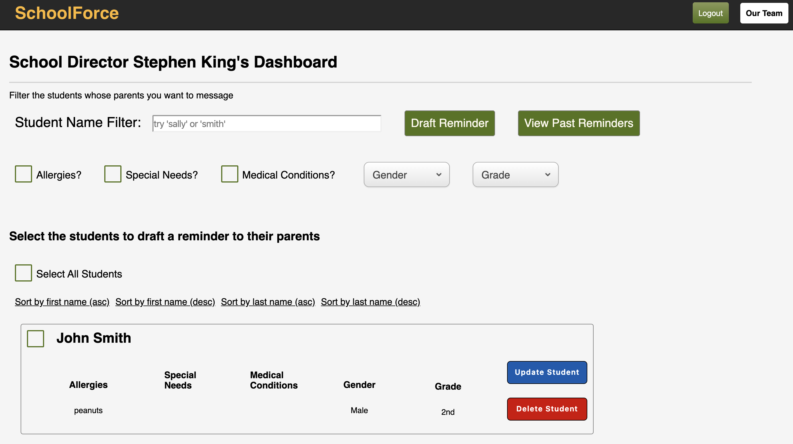
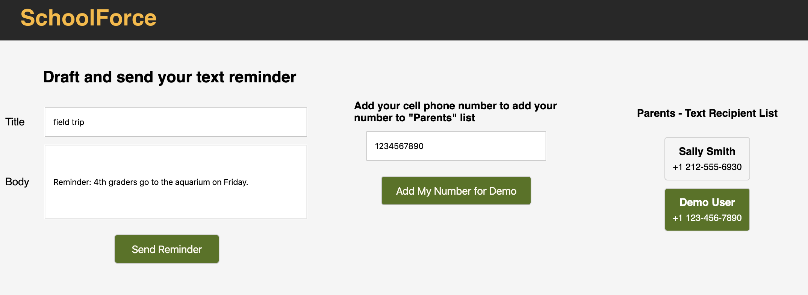

## [Live Link](https://school-force.herokuapp.com/)

SchoolForce is a light CRM tool for school directors to (1) manage communication with parents via SMS message and (2) keep track of students/students.

### When logged in as an school admin (school director), search your students using filters: name, medical conditions, allergies, etc. to select to send SMS to their parents.

-   

### School admin (school director) drafts an SMS message, sees the parents who will receive it, and sends it.

-   

* ### Technologies (MERN stack)
  * MongoDB
  * Express 4.17.1
  * React-Redux 7.2.0
  * Node.js 13.8.x
  * Heroku for hosting
  * SMS messages - [Twilio API](https://www.twilio.com/docs/usage/api)
  
* ### Wiki Links
  * [Functionality and MVP Features](https://github.com/jcolla-holla/SchoolForce/wiki/MVP-Features)
  * [Schema](https://github.com/jcolla-holla/SchoolForce/wiki/Schema)
  * [Sample State](https://github.com/jcolla-holla/SchoolForce/wiki/Sample-State)

* ### Group Members and Roles
  * Jesse Colligan - team lead
  * Antonio Cucco - backend lead
  * Stephen DiPietro - frontend lead
  * Danny Yoo - flex
  

